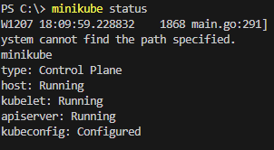

Download and Install Kubectl

Make a folder kubectl in C and download kubectl from website
<https://kubernetes.io/docs/tasks/tools/install-kubectl-windows/>

Add kubectl folder to environment variables

Run following command in cmd

kubectl version –client

Or use this for detailed view of version:

kubectl version --client --output=yaml

**Download and install minikube**

Download minikube from this website <https://minikube.sigs.k8s.io/docs/start/>

In powershell use following command

New-Item -Path 'c:\\' -Name 'minikube' -ItemType Directory -Force

Invoke-WebRequest -OutFile 'c:\\minikube\\minikube.exe' -Uri
'https://github.com/kubernetes/minikube/releases/latest/download/minikube-windows-amd64.exe'
-UseBasicParsing

It will install minikube in minikube folder in C drive

Add it to environmental variable path..You must have Docker desktop installed

Start minikube with ‘minikube start’ command

Command : **minikube status**

**Output**

type: Control Plane

host: Running

kubelet: Running

apiserver: Running

kubeconfig: Configured

**Minikube container**

Minikube container will start running

**Pull nginx image and deploy**

docker pull nginx:latest

**Make my-nginx yaml file**

apiVersion: v1

kind: Service

metadata:

name: my-nginx-svc

labels:

app: nginx

spec:

type: LoadBalancer

ports:

\- port: 80

selector:

app: nginx

\---

apiVersion: apps/v1

kind: Deployment

metadata:

name: my-nginx

labels:

app: nginx

spec:

replicas: 2

selector:

matchLabels:

app: nginx

template:

metadata:

labels:

app: nginx

spec:

containers:

\- name: nginx

image: nginx:1.14.2

ports:

\- containerPort: 80

**Deploy yaml file**

kubectl apply -f my-nginx.yaml

**It will create following 02 pods**

kubectl get pods

